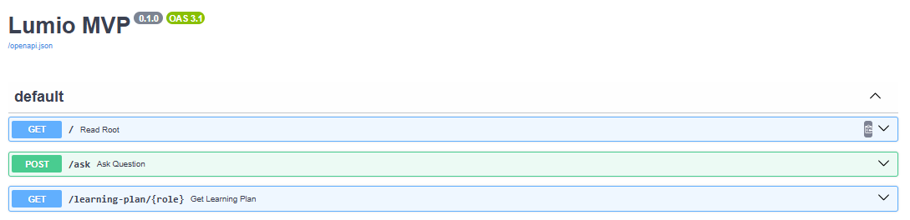
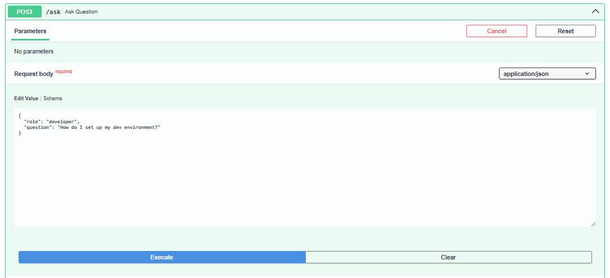
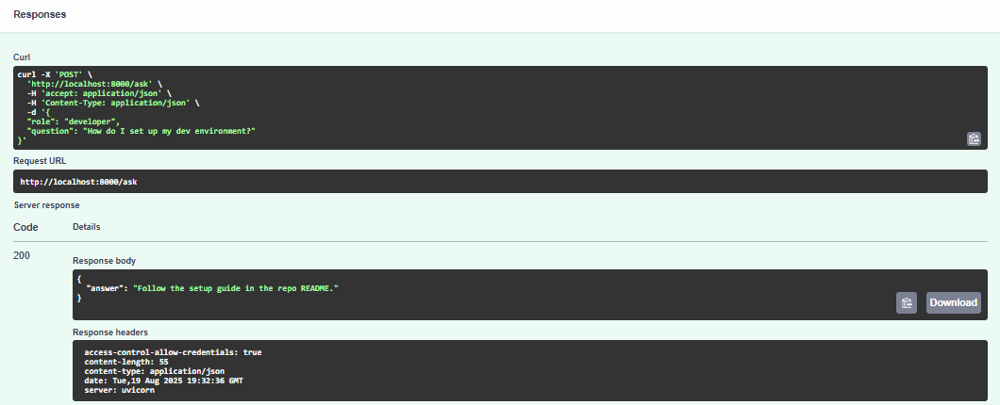
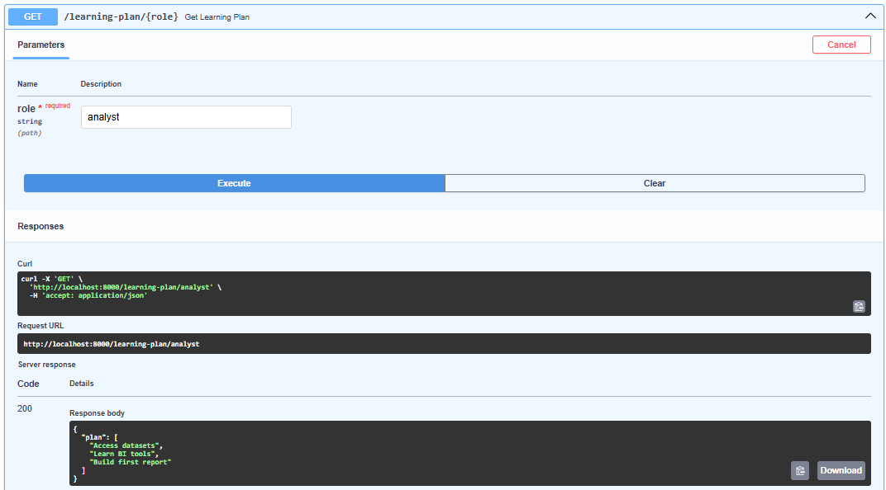

# LumioAI🔆: Backend 🔧


LumioAI Backend is a FastAPI application powering the AI-assisted learning assistant.  
It provides endpoints for generating answers and personalized learning plans, designed to integrate seamlessly with the LumioAI frontend 🙂.

---

## Table of Contents
- [About the Project](#about-the-project)
- [Features](#features)
- [Technologies](#technologies)
- [Getting Started](#getting-started)
- [Usage](#usage)
- [Beta / Development Stage](#beta--development-stage)
- [About the Author](#about-the-author)
- [License](#license)

---

## About the Project

LumioAI Backend is a modern FastAPI application that handles the logic behind LumioAI’s learning assistant.  
It provides:

- Endpoints for answering user questions via the AskForm.
- Endpoints for generating personalized learning plans based on user roles.
- A structure ready to integrate AI logic and database connections in future versions.

### Screenshots





The backend ensures the frontend has a reliable and scalable service to fetch learning content and AI answers.

---

## Features

- **POST /ask**: Accepts a user question and role, returns an AI-simulated answer.
- **GET /learning-plan/{role}**: Generates a learning plan based on the user’s role.
- Ready for database integration and AI enhancements.
- Clean and modular FastAPI structure for easy development.

---

## Technologies

- Python 3.11+
- FastAPI
- Uvicorn
- Pydantic
- Optional: SQLAlchemy or other database libraries

---

## Getting Started

To run the backend locally:

1. Clone the repository:

```bash
git clone https://github.com/monicamontesb/LumioAI-backend.git
```

2. Navigate to the backend folder:

```bash
cd lumio-backend
```

3. (Optional) Create a virtual environment:

```bash
python -m venv venv
source venv/bin/activate  # Mac/Linux
venv\Scripts\activate     # Windows
```

4. Install dependencies:

```bash
pip install -r requirements.txt
```

5. Start the FastAPI server:

```bash
uvicorn main:app --reload
```

6. Open your browser at `http://localhost:8000/docs` to explore the interactive API documentation.

---

## Usage

- Test endpoints via Swagger at `/docs`.
- Use POST /ask to simulate AI answers.
- Use GET /learning-plan/{role} to generate role-specific plans.

---

## Beta / Development Stage

> ⚠️ Beta / Work in Progress:  
> LumioAI Backend is currently in early beta. AI logic is simulated with placeholder data, and database integration is not yet implemented. Endpoints are ready for future expansion.

---

## About the Author

This project was created by **Moni**💛, a Software Engineer and aspiring Full-Stack Developer passionate about learning, technology, and creative expression.  
I enjoy combining logic and design to create interactive and visually engaging experiences.

When I’m not developing applications, I immerse myself in art, creativity, and design—always looking to make technology human and inspiring ✨🎨.

GitHub: [monicamontesb](https://github.com/monicamontesb)

---

## License

This project is licensed under the MIT License.
